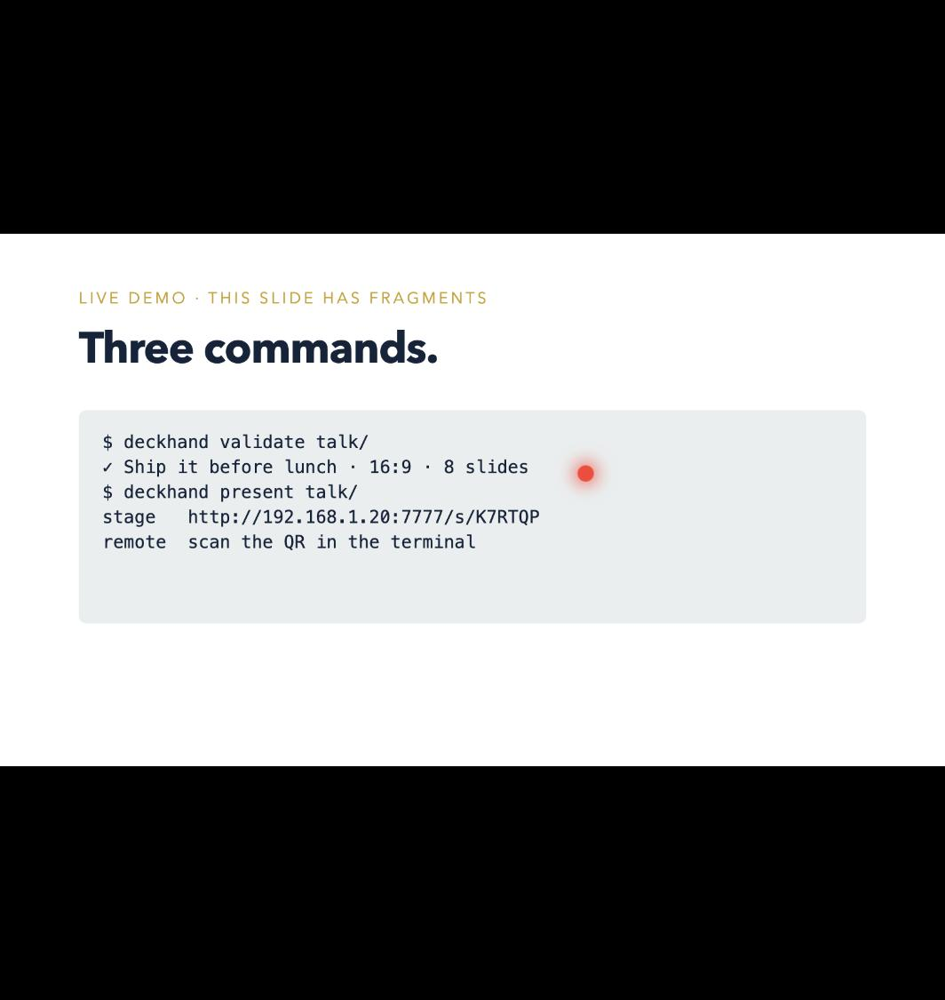
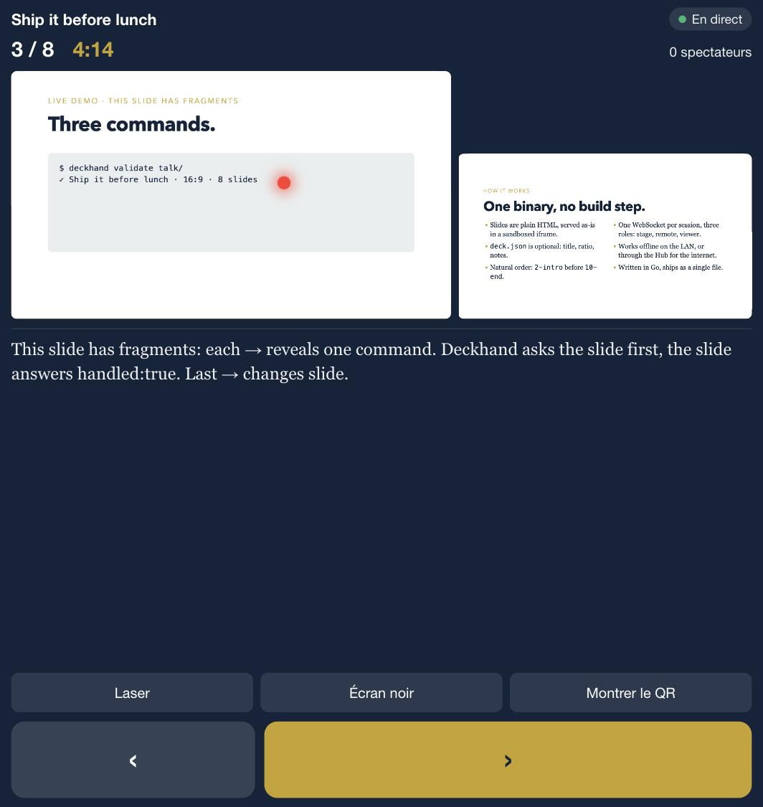

# Deckhand

**Turn a folder of HTML slides into a presentation**: a stage on the big
screen, a remote on your phone, and a live link the audience opens on theirs.

Your AI already writes one HTML file per slide. Deckhand is what presents them.

```
deckhand validate talk/     # check the deck, list every problem
deckhand present  talk/     # stage + remote + viewer on your LAN     (milestone 3)
deckhand push     talk/     # publish on a Hub, get a public link      (milestone 5)
```

<p align="center">
  
  
</p>

Local mode (`validate`, `present`, the three screens) is MIT. The hosted
**Hub** at [deckhand.stranix.net](https://deckhand.stranix.net) adds remote
viewers, permanent links and statistics; you can also
[self-host it](docs/HUB.md). Decisions in [docs/DECISIONS.md](docs/DECISIONS.md).

## Install

```
brew install stranix79/tap/deckhand          # macOS / Linux, builds from source (needs Go)
```

Or grab a binary for macOS, Linux or Windows from the
[releases](https://github.com/stranix79/deckhand/releases), or build it:

```
git clone https://github.com/stranix79/deckhand && cd deckhand
make build          # → ./deckhand
./deckhand present examples/ship-it --open
```

## Presenting

```
deckhand present talk/
```

prints three links and two QR codes. Scan **REMOTE** with your phone: it
shows the current and next slide, your notes, a timer, and drives the
presentation (prev/next, laser pointer by dragging on the thumbnail, black
screen, show the audience QR on the stage). Open the stage link on the
projector and press `f`. Share **AUDIENCE** with the room: everybody follows
live on their own screen, can browse alone and come back to live.

Everything runs on your machine, on your LAN, offline. No account.

## Beyond the LAN: the Hub

```
deckhand login --hub https://deckhand.stranix.net --token …   # token from the hub, once
deckhand push talk/                 # permanent link: https://deckhand.stranix.net/d/you/talk
deckhand present talk/ --hub https://deckhand.stranix.net     # people outside the room follow live
```

Free: one deck, ten remote viewers, links for a week. Pro: no limits.
Details in [docs/HUB.md](docs/HUB.md), the CLI in [docs/CLI.md](docs/CLI.md),
the wire protocol in [docs/PROTOCOL.md](docs/PROTOCOL.md), the threat model
in [docs/SECURITY.md](docs/SECURITY.md).

## The deck format

A directory, or a `.zip`/`.tar.gz` of it. One HTML file per slide, natural
order, optional `deck.json` for title, ratio and presenter notes. Slides may
opt into fragments with a tiny `postMessage` protocol. Everything is in
[docs/FORMAT.md](docs/FORMAT.md); [examples/ship-it](examples/ship-it) is an
eight-slide deck that uses all of it.

## Development

```
make test       # go test -race ./...
make lint       # golangci-lint
make validate   # build + validate the example deck
```

## License

MIT for everything, except `internal/hub` (the hosted multi-tenant part) which
is under the Business Source License 1.1, see [LICENSE.hub](LICENSE.hub).
Made in Belgium by [CODE79](https://stranix.net).
