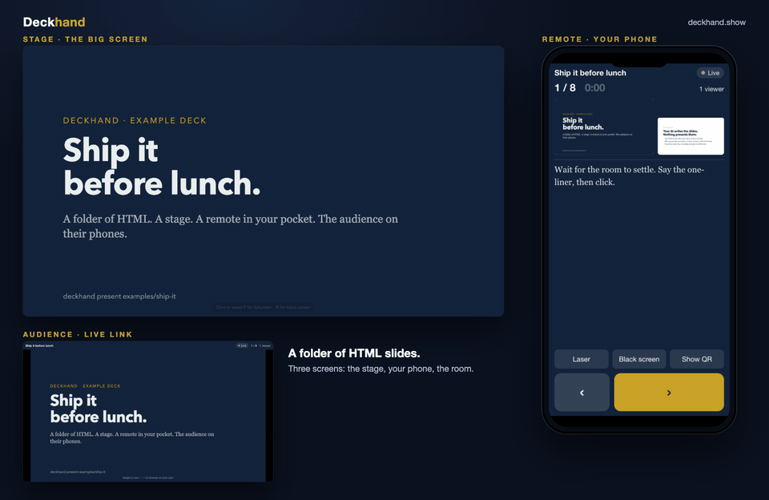

# Deckhand

**Turn a folder of HTML slides into a presentation**: a stage on the big
screen, a remote on your phone, and a live link the audience opens on theirs.

Your AI already writes one HTML file per slide. Deckhand is what presents them.

```
deckhand validate talk/     # check the deck, list every problem
deckhand present  talk/     # stage + remote + viewer on your LAN
deckhand push     talk/     # publish on a Hub, get a public link
```

<p align="center">
  
</p>

Local mode (`validate`, `present`, the three screens) is MIT. The hosted
**Hub** at [deckhand.show](https://deckhand.show) adds remote
viewers, permanent links and statistics; you can also
[self-host it](docs/HUB.md). Decisions in [docs/DECISIONS.md](docs/DECISIONS.md).

## Install

```
brew install stranix79/tap/deckhand          # macOS / Linux, builds from source (needs Go)
```

Or grab a binary for macOS, Linux or Windows from the
[releases](https://github.com/stranix79/deckhand/releases), or build it:

```
git clone https://github.com/stranix79/deckhand && cd deckhand
make build          # → ./deckhand
./deckhand present examples/ship-it --open
```

## Presenting

```
deckhand present talk/
```

prints three links and two QR codes. Scan **REMOTE** with your phone: it
shows the current and next slide, your notes, a timer, and drives the
presentation (prev/next, laser pointer by dragging on the thumbnail, black
screen, show the audience QR on the stage). Open the stage link on the
projector and press `f`. Share **AUDIENCE** with the room: everybody follows
live on their own screen, can browse alone and come back to live.

Everything runs on your machine, on your LAN, offline. No account.

## Beyond the LAN: the Hub

```
deckhand login --hub https://deckhand.show --token …   # token from the hub, once
deckhand push talk/                 # permanent link: https://deckhand.show/d/you/talk
deckhand present talk/ --hub https://deckhand.show     # people outside the room follow live
```

Free: one deck, ten remote viewers, links for a week. Pro: no limits.
Details in [docs/HUB.md](docs/HUB.md), the CLI in [docs/CLI.md](docs/CLI.md),
the wire protocol in [docs/PROTOCOL.md](docs/PROTOCOL.md), the threat model
in [docs/SECURITY.md](docs/SECURITY.md).

## The deck format

A directory, or a `.zip`/`.tar.gz` of it. One HTML file per slide, natural
order, optional `deck.json` for title, ratio and presenter notes. Slides may
opt into fragments with a tiny `postMessage` protocol. Everything is in
[docs/FORMAT.md](docs/FORMAT.md); [examples/ship-it](examples/ship-it) is an
eight-slide deck that uses all of it.

## Generate a deck with an LLM

The format is plain enough that any model can write a whole deck from one
prompt: Claude, ChatGPT, Gemini, a local model. The prompt below is precise
about what `deckhand validate` checks and what the sandbox forbids, so the
result presents without fixes. Replace TOPIC, AUDIENCE and N, paste, save
the files, then `deckhand validate my-talk/` and `deckhand present my-talk/`.
The long version with explanations, fragments and common failures is in
[docs/LLM.md](docs/LLM.md).

```
Create a slide deck for Deckhand (https://deckhand.show) about TOPIC, for AUDIENCE, in about N slides.

Output a folder named my-talk/ with one HTML file per slide plus a deck.json manifest. Rules:

1. File names: 01-title.html, 02-<short-name>.html, ... up to the last slide. Two-digit prefix, lowercase, hyphens, .html extension. The first slide is a title slide, the last one a closing slide with a one-line takeaway.
2. Each file is a complete, self-contained HTML document: <!doctype html>, <html lang="en">, <meta charset="utf-8">, a <title>, all CSS inside a <style> tag in the head, any JavaScript inside a <script> tag. No external resources at all: no CDN, no Google Fonts, no <link href="https://...">, no , no fetch or XMLHttpRequest. Slides run inside a sandboxed iframe (sandbox="allow-scripts", no allow-same-origin) and must work offline, so nothing outside the folder will load, and there is no localStorage, no cookies, no form submission, no window.open and no navigation of the parent window. Draw illustrations with inline SVG or CSS.
3. Each slide is designed for a fixed 1920x1080 canvas (16:9). Set html and body to width: 1920px; height: 1080px; margin: 0; overflow: hidden. Use pixel sizes, never vw, vh or viewport units: Deckhand scales the whole page to fit the screen. Keep text big: titles 88px or more, body text 40px or more, at most six lines of text per slide. Use system fonts (font-family: system-ui, sans-serif).
4. deck.json at the root of the folder, exactly this shape and no other keys:
{
  "title": "Deck title",
  "ratio": "16:9",
  "slides": [
    { "file": "01-title.html", "notes": "What to say on this slide, two to four sentences of plain text." },
    { "file": "02-short-name.html", "notes": "..." }
  ]
}
List every slide file in order. Every entry has "file" and "notes" (presenter notes, plain text, shown on the presenter's phone only). Add "public": true to an entry when its notes should also be shown to the audience. Unknown keys are an error.
5. One idea per slide, consistent colours and typography across all slides, high contrast.

Print each file in its own code block, preceded by its path.
```

## Development

```
make test       # go test -race ./...
make lint       # golangci-lint
make validate   # build + validate the example deck
```

## License

MIT for everything, except `internal/hub` (the hosted multi-tenant part) which
is under the Business Source License 1.1, see [LICENSE.hub](LICENSE.hub).
Made in Belgium by [CODE79](https://stranix.net).

## Support

Deckhand is free and MIT. If it saves you a talk, you can [sponsor the project on GitHub](https://github.com/sponsors/stranix79) or [buy me a Red Bull](https://ko-fi.com/stranix). Other ways: [stranix.net/soutenir](https://stranix.net/soutenir/).
